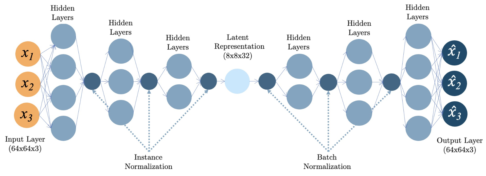
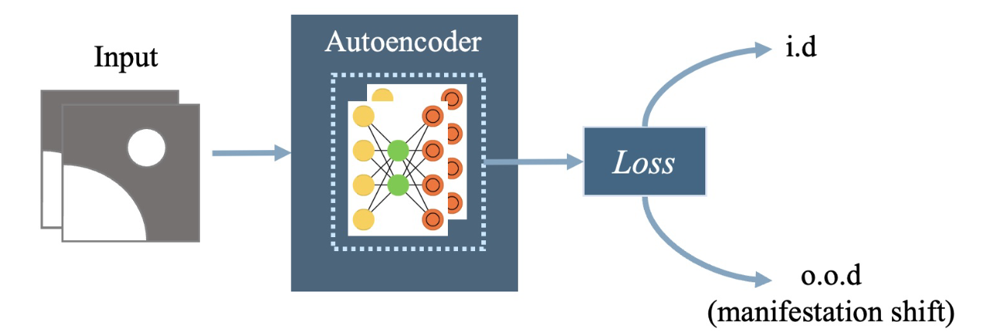

# NearOODAutoencoder

In the `Autoencoders to detect manifestation shift in medical images` research, we implemented a simple autoencoder architecture, with latent space containing a `6 times` image reduction of original medical images.



The key component of this research if available at [autoencoder.py](./architecture/autoencoder.py) file.

Key elements of this architecture:
- Style transfer concepts
  - Instance Normalization (IN) in shallow layers
  - Batch Normalization (BN) in deeper layers
- Perceptual loss (as loss function)
- Adam optimizer
- Use of loss as a metric for in-distribution (ID) or out-of-distribution (OOD) samples



Datasets:

[...]

Results published at:

```bibtex
# Autoencoders to detect manifestation shift in medical images
@inproceedings{freitas2025autoencoder,
  author={SA Freitas, CA da Costa, GO Ramos},
  booktitle={Simposio Brasileiro de Computação Aplicada a Saúde {SBCAS}, 2025, Porto Alegre, BRAZIL, June 9-13, 2025},
  publisher = {{IEEE}},
  title={Autoencoders to detect manifestation shift in medical images},
  year={2025}
}
```
